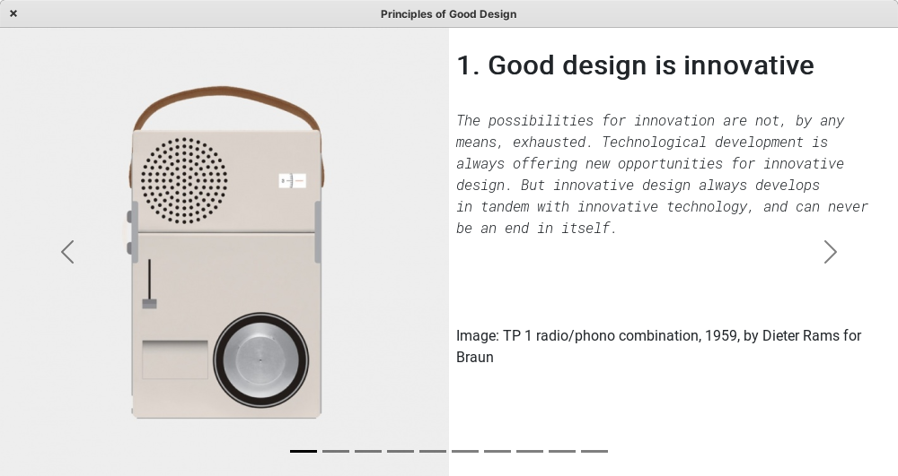

# codex-magnus

## Overview

Dieter Rams’s Ten Principles for Good Design

[Dieter Rams](https://en.wikipedia.org/wiki/Dieter_Rams) is a German industrial designer and retired academic, closely associated with the consumer products company Braun, the furniture company Vitsœ, and the functionalist school of industrial design. His unobtrusive approach and belief in "Less, but better" design generated a timeless quality in his products and have influenced the design of many products, which also secured Rams worldwide recognition and appreciation.

## "Good design" principles
Below is a list summarising his principles

1. Is innovative 
2. Makes a product useful
3. Is aesthetic
4. Makes a product understandable
5. Is unobtrusive
6. Is honest
7. Is long-lasting
8. Is thorough down to the last detail
9. Is environmentally friendly
10. Is as little design as possible

More information can be found [here](https://www.vitsoe.com/us/about/good-design)

## Application

The app explains the _10 Principles of Good Design_ in detail using a slideshow format.

### Framework

The framework used was [Neutralinojs](https://neutralino.js.org/)

It helps build lightweight cross-platform desktop apps with JavaScript, HTML, and CSS

### Binaries

To run the application simply download and run the executable for your relevant Operating System.

They are found in the `app/dist/app` directory of this repository. To download a zip file of all the binaries you can find it here:

[app/dist/app-release.zip](https://github.com/AM-ops/codex-magnus/raw/main/app/dist/app-release.zip)

Windows: [app/dist/app/app-win_x64.exe](https://github.com/AM-ops/codex-magnus/raw/main/app/dist/app/app-win_x64.exe)

Note: For Windows make sure to download the [app/dist/app/WebView2Loader.dll](https://github.com/AM-ops/codex-magnus/raw/main/app/dist/app/WebView2Loader.dll) as well.

Linux: [app/dist/app/app-linux_x64](https://github.com/AM-ops/codex-magnus/raw/main/app/dist/app/app-linux_x64)

Mac: [app/dist/app/app-mac_x64.app](https://github.com/AM-ops/codex-magnus/raw/main/app/dist/app/app-mac_x64.app)
